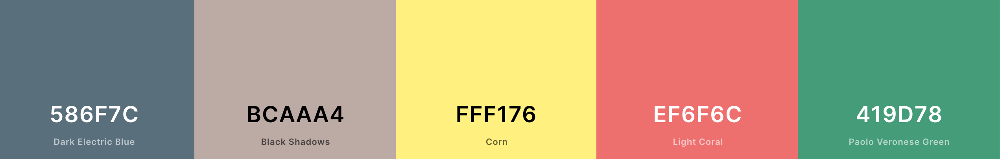

 

    

 

(in)Scribe is an online platform which enables users to track and log their own personal accounts of daily life, in essence, a journal which allows the tracking of feelings
and emotions which they may experience on a regular basis, and would like to understand how they're triggered. All of their entries are securely stored, and can be searched, edited 
and deleted with ease.

This project, as part of my Third Milestone inline with Code Institute, Dublin, has been deployed to [Github Pages](https://) and [Heroku](https://inscribe-wm.herokuapp.com/).

---

* [UX](#ux)
  * [Concept](#concept)
  * [User Stories](#user-stories)
  * [Wireframes](#wireframes)
  * [Design](#design)
    * [Colour Scheme](#colour-scheme)
    * [Typography](#typography)
    * [Imagery](#imagery)
* [Features](#features)
  * [Existing Features](#existing-features)
    * [Account Registration](#registration)
    * [About Page](#about)
    * [Community Page](#community-page)
    * [Search Entries](#search-entries)
    * [Entries](#entries)
      * [Entry Creation](#entry-creation)
      * [Entry Reading](#entry-reading)
      * [Entry Update](#entry-update)
      * [Entry Deletion](#entry-deletion)
  * [Future Implementations](#future-implementations)
* [Technologies Used](#technologies)
  * [Languages and Frameworks](#languages-and-frameworks)
  * [Libraries and Programs](#libraries-and-programs)
* [Testing](#testing)
* [Deployment](#deployment)
    * [Local Deployment](#local-deployment)
    * [Deployment to Heroku](#heroku-deployment)
* [Acknowledgements](#acknowledgements)
* [Media](#media)

---

## UX
### Concept

We, as a society, spend an inordinate amount of time interacting with a screen in some form, whether it be for personal
or business use. This could in fact be an entry of itself to input into (in)Scribe. With my inquisitive nature on wanting 
to understand the behaviours of myself and those around me, journaling became a fundamental element to daily life, 
including that of various mindfulness techniques which became habit. Similar to various other mindfulness, or journaling 
platforms available, (in)Scribe was desgined with a simple easily-navigable interface at the heart, and available to 
<em>anyone</em> with internet access, and therefore has been made responsive across Desktop and Mobile devices.

### User Stories
- As a registered user, I want to be able to record a memorable event, and what lead up to this point to make it memorable.
- As a registered user, I want to be able to search for a previously entered event, to understand and compare any similar triggers.
- As a registered user, I want to be able to update and delete a record if I deem necessary.
- As a registered user, I want the option to be able to post to a community page, where other registered users share their 
  own advice on dealing with negative or positive emotions.

### Wireframes

### Design

A custom CSS file placed within the static, assets folder of (in)Scribe, was used in conjunction with Materialize.css. 
Materialize.css was chosen (despite its frequency of updates) for <em>its</em> simplicity in approach to essential components 
I included within the project.

#### Colour Scheme

As with all online platforms, a consistent colour scheme is fundamental. With this in mind, and taking into consideration the
vibrancy and animation of the video background played on loop, it was important that the text content colour be contrasting but in-keeping 
with the background media, and where the contrast wasn't imposing enough, a transluscent/opaque white or black background was 
used behind.

* Navbar elements used #FAFAFA (white) colour, as opposed to a complete #FFFFFF (white) as it has been proven to be a less harsh contrast.
* Tag line text on the home page, used #586F7C (Dark Electric Blue), against an opaque white background, as an entirely #000000 (black) text
  blended into the darks of the video background, and the animation of the white background and dark text entering the screen, catches the users attention
  to observe the tagline text.
* All anchor elements/links used throughout the project (but not used within the navbar), had the same #FFF176 Corn (yellow) colour.
* The custom submit button used throughout the site where necessary, including being used as a redirection to the "more_info" route, embraced the
  #FFF176 Corn (yellow) colour used for other links, and #BCAAA4 (Black Shadows) for the text content.
* Conventional variations of green and red, #EF6F6C & #419D78 respectively, were used as update/edit and delete options where CRUD functions of update and
  delete were present.

    

#### Typography

Text content throughout the site was kept to a minimum of two font-families. Heading and larger text utilised the "Raleway" font-family found within the 
Google Fonts Library. Text-input and smaller text-content used a font with a similar style to "Raleway", "Quicksand" was used, also found within the 
Google Fonts Library.

#### Imagery

With a very simple project concept, imagery has been kept to an <em>absolute</em> minimum for that reason alone. The 'Scribe' element
of (in)Scribe, was decorated with a quill to simulate a the user's motion of writing something personal or of value to them. This image 
can be found on [Flaticon](https://tinyurl.com/wvrdcy2p).

Although user's may have their own version of a peaceful environment, the idea of a serene sunset with a warm coloured background, I 
felt instilled a sense of calm, and was used as an animated background, played on loop, throughout the site.

## Features
### Existing Features

#### UX
* Responsive Navbar.
* Date-picker calendar from Materialize on Entry creation.
* Tooltips to guide the user on how to search for their past entries.

#### Account Registration

* Unregistered users can sign up for an (in)Scribed account by navigating to the "registration" page using various links, within the:
  * Navbar
  * 'Create an Account' links on "home" and "sign in" pages.
* There is a set character max-length of 12, which includes the use of special characters and numbers for the user's identity.
* There is a set character min-length of 5 for an entered password, which can also include special characters and numbers, and
  will be validated using the confirm password input.

#### About Page

The 'About' page can be accessed on first visit to the site, and whilst also signed in as a registered user. The 'About' page
suggests how the platform should be used, and if a user isn't registered, gives the option to 'Create an Account'.

#### Community Page

The 'Community' page was implemented as an option for registered users to share techniques that have proven helpful when dealing
with negative or positives emotions and events. As this particular page allows users to post publically, a disclaimer header on both 
the 'suggestion listing' page <em>and</em> 'add suggestion' page is made clear so that users understand anything they share, won't be
private.

#### Entries

##### Entry Creation

* (in)Scribe account-holders have the ability to create a new entry, when they have been redirected to the 'Profile' 
page on successful sign-in.
* When clicking the "New Entry" button on the Profile page, users are redirected to a form, where all fields must be completed,
  before an entry is recorded within the database. These fields include:
  * <em>Mood</em> - This is a dropdown list, which stored as documents in a database within the same collection, which contains various emotions on a spectrum.
    This choice will act as the title for the card visible on an Entry card on the Entries page.
  * <em>Event</em> - This field, acts as the body content when clicking on an Entry card, from the Entries page
  * <em>Strength of Emotion</em> - This field, a dropdown list similar to that of the Mood field. It contains documents, ranging from 1-10, a scale in which the user
    can allocate the strength of emotion they could relate their even to.
  * <em>Solution</em> - This field has been created to encourage the user, what they'd like to happen in order to overcome or deal with the event. 
  * <em>Self-Help</em> - This field has been created to enable the user to document any self-help technique, whether it be writing/deep-breathing/meditation, or a hobby
    to keep them from becoming anxious or prevent overthinking.
  * <em>Activity Duration</em> - This field relates to the the Self-Help field, where the user can describe how long they took to complete their activity.
  * <em>Completed Solution</em> - The Completed Solution field marks whether or not a user has made the effort to work towards the solution, and shouldn't be confused
    with the Self-Help Activity.
  * <em>Date</em> - The datepicker tool from Materialize, initializes a calendar for the user to choose the date in which the entry was created. It can of course be
    updated when editing an entry.

##### Entry Reading
<em>Only</em> registered users can access their entries. For visitors to the site, who have somehow managed to obtain details regarding an entry, without being signed in to
a session, will be met with an error message when entering the page address into the url, and subsequently redirected to the Sign In page.

If a user clicks on the yellow "More Info" button within an entry card on the Entries page, this will redirect the user to a unique page "_id" relevant to that entry card.
From this page, the signed-in user, can choose to edit or delete the entry.

##### Entry Update
Similar to the Entry Reading aspect, <em>only</em> registered users can access their entries for update/editing. This can be carried out from the entries page when clicking
on an entry card, and as previously mentioned, by clicking the yellow "More Info" button. This update/edit button is shown with a green button, which on screen sizes lower
than desktop will display as a 'Pen' icon used from Materialize.

##### Entry Deletion
Entry deletion within the (in)Scribe site is simple, and can be completed by pressing the red "Delete" button on each entry when signed in as a user. The button on devices
with a screen size lower than a desktop or laptop, will display a 'Trash' icon, used from Materialize.

#### Search Entries

Signed in users have the option to search past entries using a search box on the profile page, where the option to create a new entry is. However the Search feature uses 
keywords from every entry created by a user. This however, does not affect the Community page.

### Future Implementations
I think the best practice for this type of platform would be to evaluate how users utilise the platform, which would be and ongoing process.

With mental health awareness on the taking main-stage in society, adding the option to enable the user to share posts which have been made public to social media to help others, would be a step 
in this direction. 

As a UX element, it would be in the best interest to add an interactive element to each entry card on the entries.html, which on recognition of a particular emotion or 
feeling, be able to represent that in the form of an image, which, without attributing the "entry.mood", a graphic would instead take its place.

## Technologies
### Languages and Frameworks
* HTML
* CSS
* JavaScript/jQuery
* Python
* Flask

### Libraries and Programs

* Github
* Gitpod
* Heroku
* MongoDB
* Materialize.css
* FontAwesome
* Google Fonts
* Coolors
* ScrollReveal
* PEP8
