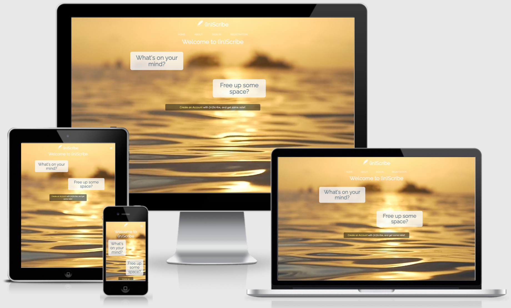

 

    

 

# Testing

Throughout the project, I chose to manually test my work so I had a firm understanding of my mistakes, and how the features I chose to implement
were going to be accessed by other users, across various device-types. This was challenging in itself, whilst trying to come to grips with certain
elements that I had experienced difficulty with, however am happy with the end result.

# Responsive Design

As this platform was built upon the concept that a user be able to access their account, providing they had an internet connection, it was vital
that it be available across multiple screen sizes, i.e. Mobile, Tablet and Desktop. 

Using various browser Developer Tools; Chrome, Safari and Opera and testing different viewport windows, such as:
  * Google Pixel
  * iPhone Models 5-11
  * iPad Pro
  * 
 
No errors presented themselves at time of testing using the above browsers.

Using [Amiresponsive](http://ami.responsivedesign.is/?url=https%3A%2F%2Finscribe-wm.herokuapp.com%2F) the responsiveness across various viewports
can be seen below.

    

