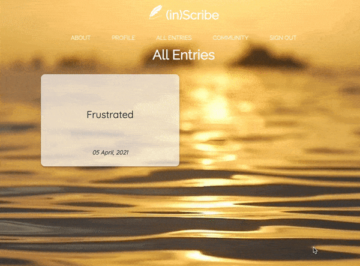

<br>
<div>
    
</div>

<br>

# Testing

Throughout the project, I chose to manually test my work so I had a firm understanding of my mistakes, and how the features I chose to implement
were going to be accessed by other users, across various device-types. This was challenging in itself, whilst trying to come to grips with certain
elements that I had experienced difficulty with, however am happy with the end result.

---
## TEST Document Navigation
* [Pages and Features](#pages-and-features)
  * [Home Page](#home-page)
  * [Registration](#registration)
  * [Sign In and Sign Out](#sign-in-and-sign-out)
  * [Profile](#profile)
  * [New Entry](#new_entry)
  * [Edit Entry](#edit-entry)
  * [More Info](#more-info)
  * [Community Suggestion](#community-suggestion)
  * [Admin Rights](#admin-rights)
* [Responsive Design](#responsive-design)


---
## Pages and Features

### Home Page
When entering the site for the first time, there is little information, other than the animated hero text, regarding the sites purpose.
This encourages the user to navigate to the relevant links, 'About' or 'Registration'. On recognition by the browser, that there is still
a current ```session user```, the 'Home' page will display a different set of navigation links whilst on a desktop viewport.

### Registration
In order for a new user to register a new account with (in)Scribe, there are three input fields which are required to be completed:
* A 'Username', taking the ```html pattern attribute``` into consideration, has to contain a minimum of five characters, however less than
  twelve, and can also contain a number.
* The 'Your Password' input field shares the ```pattern```. If the password is too short, users will encounter the 'Sorry, Something's Not Right'
  flash message.
* The 'Confirm Your Password' field must match when compared with the previous password input field. If the password doesn't match, users will 
  encounter the 'Sorry, Something's Not Right' flash message.

<div>
    
</div>

### Sign In and Sign Out
When creating the 'Registration' page, the choice to apply the 'Confirm Your Password' functionality, was copied to the 'Sign In' route. 
However, I later decided it was unnecessary, due to further reading of various articles, regarding standard practices within sign-in 
features, the 'Confirm Password' concept is becoming less popular. The already 'hashed' password that a user will input, is secure enough to 
prevent other unregistered users from viewing their entries.

### Profile
I thought it was important to identify the difference between the 'entries' each user could record, and the option to create a 'suggestion'
which are recorded for public use within the 'Community' page. Keeping these pages separate was imperative, to avoid confusion, and to ensure
users that what they were sharing via the 'Profile'/'New Entry' button, would be kept confidential, and able for viewing only by them.

Searching, Creating, Viewing, Editing and Deleting an 'entry' is <em>all</em> done through the 'Profile' page.

### New Entry

With the stated parameters atrributed to the 'New Entry' function and corresponding html template, I was able to evaluate how the following tests
would expectedly turn out.

  * Creating a new entry with empty fields will not allow the user to record said entry.
  * An entry must have an event description of minimum 5 characters, and maximum of 200. On reaching 200 characters, the input field will render the user 
    unable to enter anything else.
  * An entry with a description over 200 characters cannot be added.
  * When an entry was added, it was ensured that all corresponding fields were appropriately filled in the generated entry page.
  * Solution/Self-help/Activity duration all have a maximum input of 50 characters.
    <div>
        
    </div>

    <div>
        
        
    </div>

### Edit Entry
Similar to the 'New Entry' page, the form had to meet the same requirements regarding min/max character lengths and ensuring all input fields had been
filled.
    <div>
        
    </div>

### More Info
It was important that the entry ```_id``` was recognised through the for loop within more_info.html, and that the 'more_info' function
processed the data from MongoDB: Entries, Strengths and Moods.

For security purposes it was also important that if the url was somehow copied by an unregistered user, that they couldn't access it without being registered, 
and signed in with that specific account, without the errorhandler function being run.
    <div>
        
    </div>

### Delete Entry
The 'delete' function was implemented to allow users to remove both entries and suggestions from being associated with them. I made the decision not to implement a popup which
confirmed their choice to delete, because the option to edit was made clear in both situations, and users should have the freedom to choose the information they wish to have 
allocated to their account.
<div>
    
</div>

### Search
An index needed to be set up in order for the 'search' functionality to be operational. In the image below, the search results will only produce entries created 
by a user within <em>their</em> account, with keywords present within the entry, which of course uses information from the MongoDB collection: Entries, Strengths and Moods.
    <div>
        
    </div>

### Community Suggestion
As mentioned previously, the 'Community' page is to be used as a platform for users to provide helpful advice to others. This needed to be separated from the entries aspect of the
platform to prevent confusion. Similar to the CRUD aspects of the data accessed through (in)Scribe, no entry can be accessed by unregistered users.
    <div>
        
    </div>

### Admin Rights

Each user has the ability to Create, View, Update and delete the information they've chosen to store in (in)Scribe's 'Community' page. However, what was important, was that a user couldn't
amend or change another user's public data.
    <div>
        
    </div>
If however, there was misuse of this feature, and users were abusing this ability to share information, which is supposed to be constructive, but instead inappropriate comments were being
used, then the 'admin' account has the ability to edit or remove this comment for the well-being of every user registered with the platform.

<div>
    
</div>

### Error Handling
Previously discussed was the ability for a function to render an error-handler if a user was unauthorised to access a particular page within the platform. Below, is an example:
<div>
    
</div>

---

## Responsive Design

As this platform was built upon the concept that a user be able to access their account, providing they had an internet connection, it was vital
that it be available across multiple screen sizes, i.e. Mobile, Tablet and Desktop. 

Using various browser Developer Tools; Chrome, Safari and Opera and testing different viewport windows, such as:
  * Google Pixel
  * Huawei Mate 20X
  * Samsung Galaxy Z
  * iPhone Models 5, 6, and 11
  * iPad Pro
  * MacBook Pro

 
No errors presented themselves at time of testing using the above browsers.

Using [Amiresponsive](http://ami.responsivedesign.is/?url=https%3A%2F%2Finscribe-wm.herokuapp.com%2F) the responsiveness across various viewports
can be seen below.

<div>
    
</div>
